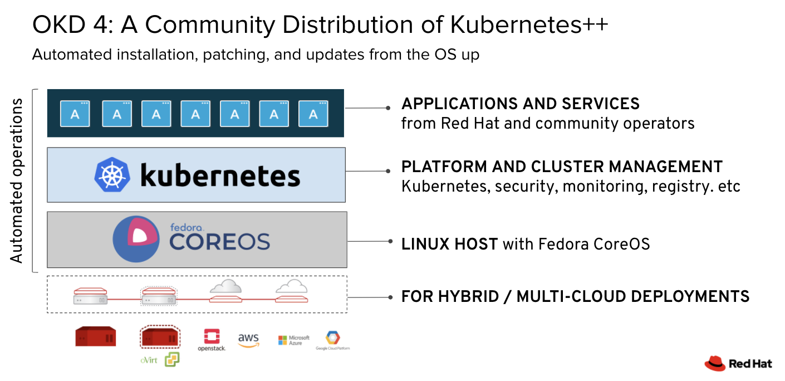
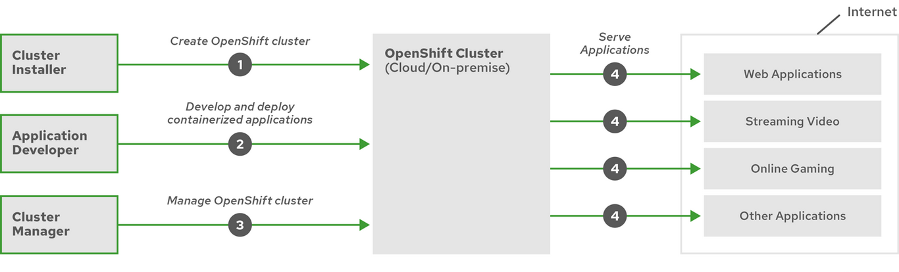

# Basics <!-- omit in toc -->

Table of Contents

---
- [What is OKD4?](#what-is-okd4)
- [OKD architecture](#okd-architecture)
- [OKD lifecycle](#okd-lifecycle)

## What is OKD4?

The Community Distribution of Kubernetes that powers Red Hat OpenShift. It is optimized for continuous application development and multi-tenant deployment. Has many features that will make developers and ops engineers more productive. Embeds Kubernetes and extends it with security and other integrated concepts:
- Hybrid cloud deployments. You can deploy OKD clusters to variety of public cloud platforms or in your data center.
- Integrated Red Hat technology. Major components in OKD come from Fedora and related Red Hat technologies. OKD benefits from the intense testing and certification initiatives for Red Hat’s enterprise quality software.
- Open source development model. Development is completed in the open, and the source code is available from public software repositories. This open collaboration fosters rapid innovation and development.

https://docs.okd.io/latest/welcome/index.html

## OKD architecture

OKD will manage not just you applications like Kubernetes, but also your whole platform.
It uses Fedora CoreOS (FCOS), a container-oriented operating system that combines some of the best features and functions of the CoreOS and Red Hat Atomic Host operating systems. FCOS is specifically designed for running containerized applications from OKD and works with new tools to provide fast installation, Operator-based management, and simplified upgrades.

FCOS includes:
- Ignition, which OKD uses as a firstboot system configuration for initially bringing up and configuring machines.
- CRI-O, a Kubernetes native container runtime implementation that integrates closely with the operating system to deliver an efficient and optimized Kubernetes experience. CRI-O provides facilities for running, stopping, and restarting containers. It fully replaces the Docker Container Engine , which was used in OKD 3.
- Kubelet, the primary node agent for Kubernetes that is responsible for launching and monitoring containers.

> For control plane machines you must use FCOS. For worker machines you can either FCOS or RHEL, but in case of RHEL you must perform more system maintenance.

### Simplified installation and update process <!-- omit in toc -->

With the right permissions deploying OKD4 is as simple as running a single command and providing a few values.
If you are using FCOS for all machines OKD will control the system and services on each machine, including the OS. Updating or upgrading OKD is a simple, highly-automated process.
If your cluster contains RHEL worker machines, the control plane benefits from the streamlined update process, but you must perform more tasks to upgrade the RHEL machines.

Other enhancements to Kubernetes in OKD include improvements in software defined networking (SDN), authentication, log aggregation, monitoring, and routing. OKD also offers a comprehensive web console and the custom OpenShift CLI (oc) interface.

https://docs.okd.io/latest/architecture/architecture.html

## OKD lifecycle
The following figure illustrates the basic OpenShift Container Platform lifecycle:
- Creating an OKD cluster
- Managing the cluster
- Developing and deploying applications
- Scaling up applications

