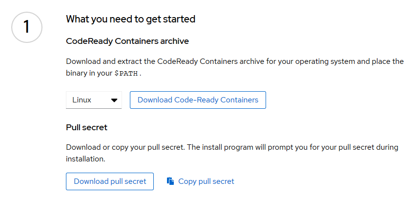
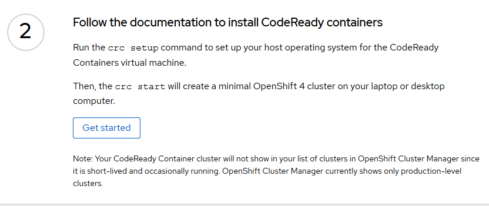
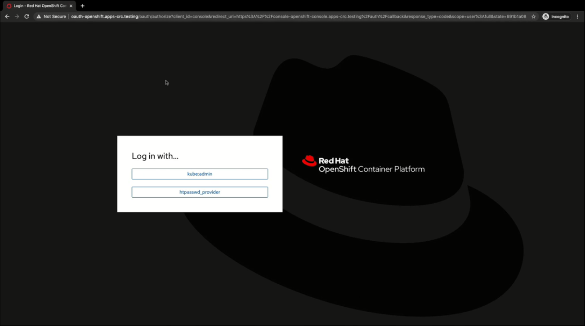

# Installation <!-- omit in toc -->

Table of Contents

---
- [Installation options](#installation-options)
- [Dev Environment with CodeReady Containers](#dev-environment-with-codeready-containers)
  - [Install CodeReady Containers](#install-codeready-containers)
  - [Start your cluster with CodeReady Containers](#start-your-cluster-with-codeready-containers)
  - [Connect to your cluster](#connect-to-your-cluster)
    - [CLI](#cli)
    - [Web UI](#web-ui)
- [Deploy OKD to AWS](#deploy-okd-to-aws)
  - [Prerequisites](#prerequisites)
    - [Configuring an AWS account](#configuring-an-aws-account)
    - [Prepare your SSH key](#prepare-your-ssh-key)
    - [Obtaining the installation program](#obtaining-the-installation-program)
    - [Prepare your Pull Secret](#prepare-your-pull-secret)
  - [Deploy the cluster](#deploy-the-cluster)
- [Customize your configuration before deployment](#customize-your-configuration-before-deployment)
- [Logging in to the cluster](#logging-in-to-the-cluster)
  


# Installation options

Available platforms:
- installer-provisioned infrastructure:
  - Amazon Web Services (AWS)
  - Google Cloud Platform (GCP)
  - Microsoft Azure
  - Red Hat OpenStack Platform (RHOSP) version 13 and 16
  - Red Hat Virtualization (RHV)
  - VMware vSphere
- user-provisioned infrastructure:
  - AWS
  - Azure
  - GCP
  - RHOSP
  - VMware vSphere
  - Bare metal
- CodeReady Containers

https://docs.okd.io/latest/architecture/architecture-installation.html

# Dev Environment with CodeReady Containers
https://access.redhat.com/documentation/en-us/red_hat_codeready_containers/1.14/html/getting_started_guide/index

Use this option to try out Openshift or for Developer Purposes.
With CodeReady Containers you can start up an Openshift Cluster on you machine.

Hardware requirements:
- 4 virtual CPUs (vCPUs)
- 9 GB of free memory (12GB if you want to enable monitoring/alerting)
- 35 GB of storage space
  
Operating system requirements:
-  Windows: Windows 10 Pro (version 1709) or newer
-  macOS: macOS 10.12 Sierra or newer
-  Linux:
	- RHEL/CentOS 7.5 or newer (including 8.x versions) and on the latest two stable Fedora releases. (supported)
	- Ubuntu 18.04 LTS or newer (unsupported)
	- Debian 10 or newer (unsupported)

Software requirements for Linux:

| Linux Distribution | Installation command |
| :--- | :---- |
| Fedora | `sudo dnf install NetworkManager` |
| Red Hat Enterprise Linux/CentOS | `su -c 'yum install NetworkManager'` |
| Debian/Ubuntu | `sudo apt install qemu-kvm libvirt-daemon libvirt-daemon-system network-manager` |

And last, but not least, You will need a RedHat user in order to access


## Install CodeReady Containers

In this guide we'll use Centos 8 as our host.

To start with CodeReady Containers first we need to download the binary from https://cloud.redhat.com/openshift/install/crc/installer-provisioned

Select your operating system, Linux in our case, and Download the archived binary.
If you have Graphical interface you can simply click on the Download button, but if you are using terminal only you can right click on that button and copy the link pointing to the file. Then with `curl`, `wget`, or your favorite CLI tool download it to your machine.

Also you'll need to copy your Pull Secret, but it'll be used later.





Then install the required packages. (`NetworkManager` for our Centos 8)

Extract the downloaded tar file.

Copy the `crc` binary somewhere to your `$PATH` (I'll use `/usr/local/bin/`)

[](https://asciinema.org/a/OQNlEB1AtNf5X1ReqxNjZeafM?autoplay=1&speed=2)


## Start your cluster with CodeReady Containers

To start our cluster CRC first needs to prepare our machine.
 - install some additional packages
 - check our host machine
 - check our user
 - setup host environment



We need to run `crc setup` for that.
> Note: `crc` needs to be run as a regular user, but the user should have sudo privilege.

If setup finished succefully, then we can start our minimal Openshift Cluster with `crc start`.
> Prepare your Pull Secret now, because starting process will need it in order to be able to access Red Hat resources.

[](https://asciinema.org/a/JiLliKZwDMQ7hQwwC8Tq7oA9N)

After you cluster started you can connect to it in two ways:
- [CLI](#cli)
- [Web UI](#web-ui)


## Connect to your cluster
### CLI

You can connect to your cluster using the openshift client.
* `crc oc-env` will print out the command you need to run in order to add `oc` to your `$PATH`.

* or you can download the oc binary as well.  
   You can download it from https://mirror.openshift.com/pub/openshift-v4/clients/ocp/latest/openshift-client-linux.tar.gz  
   Like before we can use `curl` or `wget`, extract the archive and copy it to `/usr/local/bin/`

You can test it with `oc version`

At the end of the installation you'll get commands with credentials which you can use to connect to the newly installed cluster.
Something like:
>oc login -u kubeadmin -p ILWgF-VfgcQ-p6mJ4-Jztez https://api.crc.testing:6443

kubeadmin -> admin user
developer -> regular user

If you forgot to copy those credentials, you could print them out with `crc console --credentials`


### Web UI

In order to access the Web Interface run `crc console`.
It'll open up your default browser with a login page to your cluster.
Something like this:


https://access.redhat.com/documentation/en-us/red_hat_codeready_containers/1.15/html/getting_started_guide/using-codeready-containers_gsg


# Deploy OKD to AWS
## Prerequisites
### Configuring an AWS account

Before you can install OKD, you must configure an Amazon Web Services (AWS) account.


#### Configuring Route53 <!-- omit in toc -->

To install OKD, the AWS account you use must have a dedicated **public hosted zone** in your Route53 service. This zone **must be authoritative** for the domain. The Route53 service provides cluster DNS resolution and name lookup for external connections to the cluster.

> You can either use a domain or subdomain, but Route53 must be authoritative for for the zone.


#### Creating an IAM user <!-- omit in toc -->

Before you install OKD, create a IAM administrative user. 
Set the following options:
1. Select Programmatic access.
2. Attach the AdministratorAccess policy to ensure that the account has sufficient permission
3. (Optional:) Add metadata to the user by attaching tags.
4. Confirm that the user name that you specified is granted the AdministratorAccess policy.
5. Record the access key ID and secret access key values. You must use these values when you configure your local machine to run the installation program.


#### AWS account limits <!-- omit in toc -->

The OKD cluster uses a number of AWS components, and the default Service Limits affect your ability to install OKD clusters. If you use certain cluster configurations, deploy your cluster in certain AWS regions, or run multiple clusters from your account, you might need to request additional resources for your AWS account.

https://docs.okd.io/latest/installing/installing_aws/installing-aws-account.html#installation-aws-limits_installing-aws-account


### Prepare your SSH key

If you want to perform installation debugging or disaster recovery on your cluster, you must provide an SSH key to both your ssh-agent and to the installation program.
> You must use a local key, not one that you configured with platform-specific approaches such as AWS key pairs.


### Obtaining the installation program

We'll download it from https://github.com/openshift/okd/releases
You can find both the openshift-install and the openshift-client here. So get both of them, extract the archives, and copy the binaries somewhere to your `$PATH`.


### Prepare your Pull Secret

Just like deploying with CodeReady Containers your Pull Secret will be needed for the install program.
You can get your Pull Secret from [here](https://cloud.redhat.com/openshift/install/pull-secret)

https://docs.okd.io/latest/installing/installing_aws/installing-aws-account.html


## Deploy the cluster

Run the installation program
```bash
./openshift-install create cluster \
  --dir=<installation_directory> \
  --log-level=info
```

For *<installation_directory>*, specify the directory name to store the files that the installation program creates. Specify an empty directory.

To view different installation details, specify `warn`, `debug`, or `error` instead of `info`.

Provide values at the prompts:
1. Select an SSH key to use to access your cluster machines.
2. Select aws as the platform to target.
3. If you do not have an AWS profile stored on your computer, enter the AWS access key ID and secret access key for the user that you configured to run the installation program.
4. Select the AWS region to deploy the cluster to.
5. Select the base domain for the Route53 service that you configured for your cluster.
6. Enter a descriptive name for your cluster.
7. Paste the pull secret that you obtained from the Pull Secret page on the Red Hat OpenShift Cluster Manager site. This field is optional.

When the cluster deployment completes, directions for accessing your cluster, including a link to its web console and credentials for the kubeadmin user, display in your terminal.
If you by mistake cleared the screen and can't find the credentials the the kubeadmin user check the `.openshift_install.log` in the *<installation_directory>*.

> The Ignition config files that the installation program generates contain certificates that expire after 24 hours. You must keep the cluster running for 24 hours in a non-degraded state to ensure that the first certificate rotation has finished.

> You must keep the installation program and the files that the installation program creates. Both are required to delete the cluster.

8. Optional: Remove or disable the AdministratorAccess policy from the IAM account that you used to install the cluster.

https://docs.okd.io/latest/installing/installing_aws/installing-aws-default.html#installation-launching-installer_installing-aws-default


# Customize your configuration before deployment

In OKD version Latest, you can install a customized cluster on infrastructure that the installation program provisions on AWS. To customize the installation, you modify parameters in the `install-config.yaml` file before you install the cluster.

To create `install-config.yaml` file run:
```bash
./openshift-install create install-config \
  --dir=<installation_directory>
```

This will guide you through the same steps as `create cluster` option, but it will only generate the configuration file, which will contain:
- the base domain
- base information about the worker and control plane nodes
- name of your cluster
- cluster, machine and service network information
- AWS region
- your ssh key
- your pull secret
> your AWS IAM credentials will be stored at the default location in `<HOME>/.aws/` folder

Now you can modify the config file to your needs before deploying the cluster. (After installing the cluster you can't modify the file.)
> **Backup your file!** The install program will remove it from *<installation_directory>*.
For more information about config file parameters please check [Installation configuration parameters](https://docs.okd.io/latest/installing/installing_aws/installing-aws-customizations.html#installation-configuration-parameters_installing-aws-customizations)

Sample `install-config.yaml` file for AWS:  
[sample-install-config.yaml](files/sample-install-config.yaml)

https://docs.okd.io/latest/installing/installing_aws/installing-aws-customizations.html


# Logging in to the cluster

You can log in to your cluster as a default system user by exporting the cluster `kubeconfig` file. The `kubeconfig` file contains information about the cluster that is used by the CLI to connect a client to the correct cluster and API server. The file is specific to a cluster and is created during OKD installation.

The `kubeconfig` file can be found in the *<installation_directory>*/auth folder.

Export the `kubeadmin` credentials:
```bash
export KUBECONFIG=<installation_directory>/auth/kubeconfig
```

Verify you can run oc commands successfully using the exported configuration:
```bash
oc whoami
```

Example output:
```bash
system:admin
```

https://docs.okd.io/latest/installing/installing_aws/installing-aws-customizations.html#cli-logging-in-kubeadmin_installing-aws-customizations