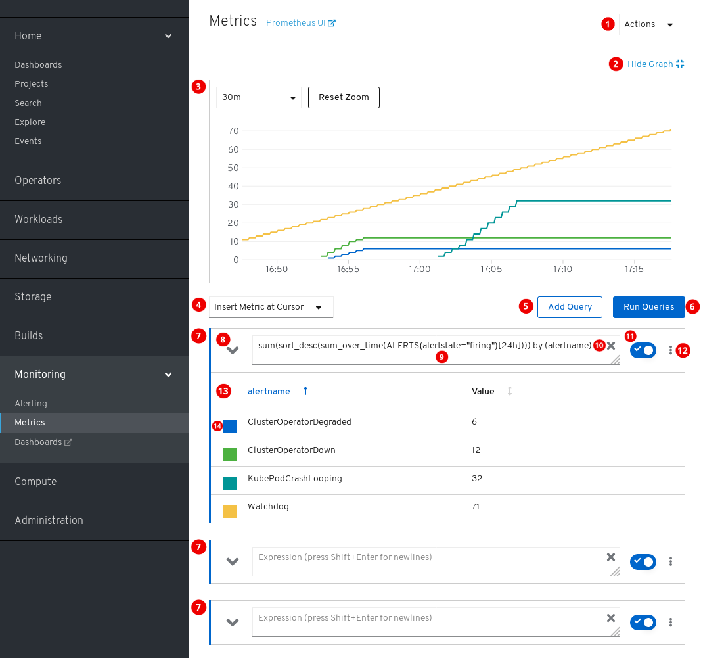

# Manage OKD4 <!-- omit in toc -->

Table of Contents

---
- [About the CLI](#about-the-cli)
- [Installing the CLI on Linux](#installing-the-cli-on-linux)
- [Logging in to the CLI](#logging-in-to-the-cli)
- [Using the CLI](#using-the-cli)
  - [Basic commands](#basic-commands)
  - [Enabling tab completion](#enabling-tab-completion)
- [Web UI](#web-ui)
  - [Understanding and accessing the web console](#understanding-and-accessing-the-web-console)
  - [Using the OKD dashboard to get cluster information](#using-the-okd-dashboard-to-get-cluster-information)
  - [Developer perspective in the web console](#developer-perspective-in-the-web-console)
- [Projects](#projects)
  - [Working with projects using the CLI](#working-with-projects-using-the-cli)
  - [Working with projects using the web console](#working-with-projects-using-the-web-console)
- [Application management](#application-management)
  - [Creating an application from source code using the CLI](#creating-an-application-from-source-code-using-the-cli)
  - [Creating an application from an image](#creating-an-application-from-an-image)
  - [Creating an application from a template](#creating-an-application-from-a-template)
  - [Object created with `new-app` command](#object-created-with-new-app-command)
  - [Specifying environment variables](#specifying-environment-variables)
  - [Searching for images, templates, and other inputs](#searching-for-images-templates-and-other-inputs)
  - [Viewing pods using the CLI](#viewing-pods-using-the-cli)
  - [Viewing pod logs using the CLI](#viewing-pod-logs-using-the-cli)
  - [Importing, Exporting and Configure Kubernetes Resources](#importing-exporting-and-configure-kubernetes-resources)
- [Monitoring](#monitoring)
  - [Alerting UI](#alerting-ui)
  - [Cluster metrics](#cluster-metrics)
  - [Events, logs and metrics in CLI](#events-logs-and-metrics-in-cli)

# About the CLI
With the OKD command-line interface (CLI), you can create applications and manage OKD projects from a terminal. The CLI is ideal in situations where you:
- Work directly with project source code.
- Script OKD operations.
- Are restricted by bandwidth resources and can not use the web console.

# Installing the CLI on Linux
You can install the OpenShift CLI (`oc`) binary on Linux by using the following procedure.

1. Navigate to https://mirror.openshift.com/pub/openshift-v4/clients/oc/latest/ and choose the folder for your operating system and architecture.
2. Download `oc.tar.gz`.
3. Unpack the archive:  
`tar xvzf <file>`
4. Place the `oc` binary in a directory that is on your `PATH`.
To check your `PATH`, execute the following command:  
`echo $PATH`

After you install the CLI, it is available using the oc command:
```
oc <command>
```

https://docs.okd.io/latest/cli_reference/openshift_cli/getting-started-cli.html#cli-installing-cli-on-linux_cli-developer-commands

# Logging in to the CLI
You can log in to the `oc` CLI to access and manage your cluster.

Log in to the CLI using the `oc login` command and enter the required information when prompted.
```
oc login
```

Example output:
```
Server [https://localhost:8443]: https://openshift.example.com:6443
The server uses a certificate signed by an unknown authority.
You can bypass the certificate check, but any data you send to the server could be intercepted by others.
Use insecure connections? (y/n): y 

Authentication required for https://openshift.example.com:6443 (openshift)
Username: user1 
Password: 
Login successful.

You don't have any projects. You can try to create a new project, by running

	oc new-project <projectname>

Welcome! See 'oc help' to get started.
```


# Using the CLI
## Basic commands
### Creating a project <!-- omit in toc -->
```
oc new-project my-project
```

Example output:
```
Now using project "my-project" on server "https://openshift.example.com:6443".
```

### Check status of current project <!-- omit in toc -->
```
oc status
```

Example output:
```
In project my-project on server https://openshift.example.com:6443

svc/cakephp-ex - 172.30.236.80 ports 8080, 8443
  dc/cakephp-ex deploys istag/cakephp-ex:latest <-
    bc/cakephp-ex source builds https://github.com/sclorg/cakephp-ex on openshift/php:7.2
    deployment #1 deployed 2 minutes ago - 1 pod

3 infos identified, use 'oc status --suggest' to see details.
```

### Viewing the current project <!-- omit in toc -->
```
oc project
```

Example output:
```
Using project "my-project" on server "https://openshift.example.com:6443".
```

### Creating a new app <!-- omit in toc -->
```
oc new-app https://github.com/sclorg/cakephp-ex
```

Example output:
```
--> Found image 40de956 (9 days old) in imagestream "openshift/php" under tag "7.2" for "php"

...

    Run 'oc status' to view your app.
```

### Viewing pods <!-- omit in toc -->
```
oc get pods -o wide
```

### Viewing pod logs <!-- omit in toc -->
```
oc logs cakephp-ex-1-deploy
```


### Listing supported API resources <!-- omit in toc -->
```
oc api-resources
```

Example output:
```
NAME                                  SHORTNAMES       APIGROUP                              NAMESPACED   KIND
bindings                                                                                     true         Binding
componentstatuses                     cs                                                     false        ComponentStatus
configmaps                            cm                                                     true         ConfigMap
...
```

### Check current session information <!-- omit in toc -->
```
oc whoami
```

### End current session <!-- omit in toc -->
```
oc logout
```

### Getting help <!-- omit in toc -->
Get a list and description of all available CLI commands:
```
oc help
```

Get help about a specific CLI command:
```
oc <command> --help
```


## Enabling tab completion
After you install the `oc` CLI tool, you can enable tab completion to automatically complete `oc` commands or suggest options when you press Tab.

1. Save the Bash completion code to a file.
```
oc completion bash > oc_bash_completion
```

2. Copy the file to /etc/bash_completion.d/
```
sudo cp oc_bash_completion /etc/bash_completion.d/
```

You can also save the file to a local directory and source it from your `.bashrc` file instead.


# Web UI
The OKD web console is a user interface accessible from a web browser. Developers can use the web console to visualize, browse, and manage the contents of projects.
> JavaScript must be enabled to use the web console. For the best experience, use a web browser that supports WebSockets.

## Understanding and accessing the web console
The web console runs as a Pod on the master. The static assets required to run the web console are served by the Pod. Once OKD is successfully installed, find the URL for the web console and login credentials for your installed cluster in the CLI output of the installation program. For example:
```
INFO Install complete!
INFO Run 'export KUBECONFIG=<your working directory>/auth/kubeconfig' to manage the cluster with 'oc', the OpenShift CLI.
INFO The cluster is ready when 'oc login -u kubeadmin -p <provided>' succeeds (wait a few minutes).
INFO Access the OpenShift web-console here: https://console-openshift-console.apps.demo1.openshift4-beta-abcorp.com
INFO Login to the console with user: kubeadmin, password: <provided>
```
Use those details to log in and access the web console.

## Using the OKD dashboard to get cluster information

Access the OKD dashboard, which captures high-level information about the cluster, by navigating to **Home** → **Dashboards** → **Overview** from the OKD web console.

The OKD dashboard provides various cluster information, captured in individual dashboard cards.

The OKD dashboard consists of the following cards:
- **Details** provides a brief overview of informational cluster details.  
Status include ok, error, warning, in progress, and unknown. Resources can add custom status names.
  - Cluster ID
  - Provider
  - Version

- **Cluster Inventory** details number of resources and associated statuses. It is helpful when intervention is required to resolve problems, including information about:
  - Number of nodes
  - Number of Pods
  - Persistent storage volume claims
  - Bare metal hosts in the cluster, listed according to their state (only available in metal3 environment).

- **Cluster Capacity** charts help administrators understand when additional resources are required in the cluster. The charts contain an inner ring that displays current consumption, while an outer ring displays thresholds configured for the resource, including information about:
  - CPU time
  - Memory allocation
  - Storage consumed
  - Network resources consumed

- **Cluster Utilization** shows the capacity of various resources over a specified period of time, to help administrators understand the scale and frequency of high resource consumption.

- **Events** lists messages related to recent activity in the cluster, such as Pod creation or virtual machine migration to another host.

- **Top Consumers** helps administrators understand how cluster resources are consumed. Click on a resource to jump to a detailed page listing Pods and nodes that consume the largest amount of the specified cluster resource (CPU, memory, or storage).


## Developer perspective in the web console
The OKD web console provides two perspectives:
 - the **Administrator** perspective and 
 - the **Developer** perspective.


> The default web console perspective that is shown depends on the role of the user. The Developer perspective is displayed by default if the user is recognised as a developer.


### Accessing Developer Perspective <!-- omit in toc -->
The **Developer** perspective in the OKD web console provides workflows specific to developer use cases.

You can access the **Developer** perspective from the web console as follows:
1. Log in to the OKD web console using your login credentials. The default view for the OKD web console is the **Administrator** perspective.
2. Use the perspective switcher to switch to the **Developer** perspective. The **Topology** view with a list of all the projects in your cluster is displayed.  

3. Select an existing project from the list or use the **Project** drop-down list to create a new project.

If you have no workloads or applications in the project, the **Topology** view displays the available options to create applications. If you have existing workloads, the **Topology** view graphically displays your workload nodes.


# Projects
A *project* allows a community of users to organize and manage their content in isolation from other communities.

> Projects starting with `openshift-` and `kube-` are default projects. These projects host cluster components that run as Pods and other infrastructure components. As such, OKD does not allow you to create Projects starting with `openshift-` or `kube-` using the `oc new-project` command. Cluster administrators can create these Projects using the `oc adm new-project` command.

## Working with projects using the CLI
### Creating a project using the CLI <!-- omit in toc -->
```
oc new-project <project_name>  --description="<description>" --display-name="<display_name>"
```
> Creating a new project will automatically change the current project of your session to the new project


### Viewing a project using the CLI <!-- omit in toc -->
When viewing projects, you are restricted to seeing only the projects you have access to view based on the authorization policy.

List projects:
```
oc get projects
```
> **\*** signifies the current project

Change current project:
```
oc project <project_name>
```

### Checking project status using the CLI <!-- omit in toc -->
```
oc status
```

This command provides a high-level overview of the current project, with its components and their relationships.

### Deleting a project using the CLI <!-- omit in toc -->
When you delete a project, the server updates the project status to **Terminating** from **Active**. Then, the server clears all content from a project that is in the **Terminating** state before finally removing the project. While a project is in **Terminating** status, you cannot add new content to the project. Projects can be deleted from the CLI or the web console.
```
oc delete project <project_name>
```

## Working with projects using the web console
### Creating a project using the web console <!-- omit in toc -->
1. Navigate to **Home** → **Projects**.
2. Click **Create Project**.
3. Enter your project details.
4. Click **Create**.

#### Creating a project using the Developer perspective in the web console <!-- omit in toc -->
1. Click the **Project** drop-down menu to see a list of all available projects. Select **Create Project**.
2. In the **Create Project** dialog box, enter a unique name, such as `myproject`, in the **Name** field.
3. Optional: Add the **Display Name** and **Description** details for the project.
4. Click **Create**.
5. Use the left navigation panel to navigate to the **Project** view and see the dashboard for your project.

### Viewing a project using the web console <!-- omit in toc -->
1. Navigate to **Home** → **Projects**.
2. Select a project to view.  
On this page, click the **Workloads** button to see workloads in the project.

### Checking project status using the web console <!-- omit in toc -->
1. Navigate to **Home** → **Projects**.
2. Select a project to see its status.

### Deleting a project using the web console <!-- omit in toc -->
1. Navigate to **Home** → **Projects**.
2. Locate the project that you want to delete from the list of projects.
3. On the far right side of the project listing, select **Delete Project** from the Options menu .
> If you do not have permissions to delete the project, the **Delete Project** option is not available.
4. When the **Delete Project** pane opens, enter the name of the project that you want to delete in the field.
5. Click **Delete**.

https://docs.okd.io/latest/applications/projects/working-with-projects.html


# Application management
## Creating an application from source code using the CLI
With the `new-app` command you can create applications from source code in a local or remote Git repository.

The `new-app` command creates a build configuration, which itself creates a new application image from your source code. The `new-app` command typically also creates a deployment configuration to deploy the new image, and a service to provide load-balanced access to the deployment running your image.

### Local <!-- omit in toc -->
```
oc new-app /<path to source code>
```

### Remote <!-- omit in toc -->
```
oc new-app https://github.com/sclorg/cakephp-ex
```


## Creating an application from an image
You can deploy an application from an existing image. Images can come from imagestreams in the OKD server, images in a specific registry, or images in the local Docker server.

### DockerHub MySQL image <!-- omit in toc -->
Create an application from the DockerHub MySQL image, for example:
```
oc new-app mysql
```

### Image in a private registry <!-- omit in toc -->
Create an application using an image in a private registry, specify the full container image specification:
```
oc new-app myregistry:5000/example/myimage
```

### Existing imagestream and optional imagestreamtag <!-- omit in toc -->
Create an application from an existing imagestream and optional imagestreamtag:
```
oc new-app my-stream:v1
```

## Creating an application from a template
You can create an application from a previously stored template or from a template file, by specifying the name of the template as an argument. For example, you can store a sample application template and use it to create an application.

Upload an application template to your current project’s template library. The following example uploads an application template from a file called `examples/sample-app/application-template-stibuild.json`:
```
oc create -f examples/sample-app/application-template-stibuild.json
```

Then create a new application by referencing the application template. In this example, the template name is `ruby-helloworld-sample`:
```
oc new-app ruby-helloworld-sample
```

To create a new application by referencing a template file in your local file system, without first storing it in OKD, use the `-f|--file` argument. For example:
```
oc new-app -f examples/sample-app/application-template-stibuild.json
```

## Object created with `new-app` command
The `new-app` command generates OKD objects that build, deploy, and run the application that is created.

| Object | Description |
| :--- | :--- |
| BuildConfig | A BuildConfig is created for each source repository that is specified in the command line. The BuildConfig specifies the strategy to use, the source location, and the build output location. |
| ImageStreams | For BuildConfig, two ImageStreams are usually created. One represents the input image. With Source builds, this is the builder image. With Docker builds, this is the FROM image. The second one represents the output image. If a container image was specified as input to new-app, then an imagestream is created for that image as well. |
| DeploymentConfig | A DeploymentConfig is created either to deploy the output of a build, or a specified image. The new-app command creates emptyDir volumes for all Docker volumes that are specified in containers included in the resulting DeploymentConfig. |
| Service | The new-app command attempts to detect exposed ports in input images. It uses the lowest numeric exposed port to generate a service that exposes that port. In order to expose a different port, after new-app has completed, simply use the oc expose command to generate additional services. |
| Other | Other objects can be generated when instantiating templates, according to the template. |

## Specifying environment variables
When generating applications from a template, source, or an image, you can use the `-e|--env` argument to pass environment variables to the application container at run time:
```
oc new-app openshift/postgresql-92-centos7 \
    -e POSTGRESQL_USER=user \
    -e POSTGRESQL_DATABASE=db \
    -e POSTGRESQL_PASSWORD=password
```

## Creating objects with different names <!-- omit in toc -->
```
oc new-app https://github.com/openshift/ruby-hello-world --name=myapp
```

## Creating objects in a different project <!-- omit in toc -->
```
oc new-app https://github.com/openshift/ruby-hello-world -n myproject
```

## Searching for images, templates, and other inputs
To search for images, templates, and other inputs for the `oc new-app` command, add the `--search` and `--list` flags. For example, to find all of the images or templates that include PHP:
```
oc new-app --search php
```


## Viewing pods using the CLI
```
oc get pods -o wide
```

> get all resources within current project:
> 
> `oc get all`

## Viewing pod logs using the CLI
```
oc logs -f <resource_type>/<resource_name>
```

Example: 
```
oc logs -f bc/cakephp-ex
```


## Importing, Exporting and Configure Kubernetes Resources
You can use the `-o yaml` (or `-o json`) flags with `get` command to print the output as yaml (or json) format.
This output can be saved as a file, which contains the OKD resource's parameters (kind of a backup of that resource's configuration).

### Export resources to yaml file <!-- omit in toc -->
```
oc get -o yaml <resource> > <resource>.yaml
```

### Export resources to json file <!-- omit in toc -->
```
oc get -o json <resource> > <resource>.json
```

### Create a resource from yaml file <!-- omit in toc -->
```
oc create -f <resource>.yaml
```

### Create a resource from json file <!-- omit in toc -->
```
oc create -f <resource>.json
```

### Replace	a rescource <!-- omit in toc -->
You can replace an existing resource from file or stdin. This will apply the resource with the same name, but modified content.
```
oc replace <resource>.yaml
```

### Apply config to a resource <!-- omit in toc -->
Apply a config to a resource by filename or stdin
```
oc apply -f <resource>.yaml
```
		
### Extract secrets or a configmap to disk <!-- omit in toc -->
Extract the contents of a ConfigMap or secret. Each key in the ConfigMap or secret is created as a separate file with the name of the key.
```
oc extract
```
		
### Copy files between filesystem and Pod <!-- omit in toc -->
Copy contents of a directory to or from a running Pod container. Only changed files are copied using the rsync command from your operating system.
```
oc rsync <path to files> <pod to copy to>
```


# Monitoring
OKD includes a pre-configured, pre-installed, and self-updating monitoring stack that is based on the [Prometheus](https://prometheus.io/) open source project and its wider eco-system. It provides monitoring of cluster components and includes a set of alerts to immediately notify the cluster administrator about any occurring problems and a set of [Grafana](https://grafana.com/) dashboards. The cluster monitoring stack is only supported for monitoring OKD clusters.

- To access **Prometheus**, navigate to the "Monitoring" → "Metrics" page.
- To access the **Alerting UI**, navigate to the "Monitoring" → "Alerting" page.
- To access **Grafana**, navigate to the "Monitoring" → "Dashboards" page.


## Alerting UI
The Alerting UI is accessible by clicking **Monitoring** → **Alerting** in the OKD web console.

The three main pages of the Alerting UI are the Alerts, the Silences, and the Alerting rules pages.

### The Alerts page: <!-- omit in toc -->

1. Filtering alerts by their names.
2. Filtering the alerts by their states. To fire, some alerts need a certain condition to be true for the duration of a timeout. If a condition of an alert is currently true, but the timeout has not been reached, such an alert is in the **Pending** state.
3. Alert name.
4. Description of an alert.
5. Value of the Severity label of the alert.
6. Current state of the alert and when the alert went into this state.
7. Actions you can do with the alert.


### The Silences page: <!-- omit in toc -->

1. Creating a silence for an alert.
2. Filtering silences by their name.
3. Filtering silences by their states. If a silence is pending, it is currently not active because it is scheduled to start at a later time. If a silence expired, it is no longer active because it has reached its end time.
4. Description of a silence. It includes the silence name and the specification of alerts that it matches.
5. Number of alerts that are being silenced by the silence.
6. Current state of the silence. For active silences, it shows when the silence ends. For pending silences, it shows when the silence starts.
7. User that created the silence.
8. Actions you can do with a silence.

### The Alerting Rules page: <!-- omit in toc -->

1. Filtering Alerting Rules by their name.
2. Filtering Alerting Rules by their states.
3. Alerting Rule name.
4. Value of the Severity label of the Alerting Rule.
5. State of the Alert defined by the Alerting Rule.

Also, next to the title of each of these pages is a link to the Alertmanager interface.


## Cluster metrics
OKD Latest provides a web interface to Prometheus, which enables you to run Prometheus Query Language (PromQL) queries and examine the metrics visualized on a plot. This functionality provides an extensive overview of the cluster state and enables you to troubleshoot problems.

### Metrics UI <!-- omit in toc -->
The **Metrics** page is accessible by clicking **Monitoring** → **Metrics** in the OKD web console.


1. Actions.
   - Add query.
   - Expand or collapse all query tables.
   - Delete all queries.
2. Hide the plot.
3. The interactive plot.
4. The catalog of available metrics.
5. Add query.
6. Run queries.
7. Query forms.
8. Expand or collapse the form.
9. The query.
10. Clear query.
11. Enable or disable query.
12. Actions for a specific query.
   - Enable or disable query.
   - Show or hide all series of the query from the plot.
   - Delete query.
13. The metrics table for a query.
14. Color assigned to the graph of the metric. Clicking the square shows or hides the metric’s graph.

Additionally, there is a link to the old Prometheus interface next to the title of the page.


## Events, logs and metrics in CLI

### Events <!-- omit in toc -->
Events are associated with a namespace, either the namespace of the resource they are related to or, for cluster events, the `default` namespace. The `default` namespace holds relevant events for monitoring or auditing a cluster, such as *Node* events and resource events related to infrastructure components.

The master API and `oc` command do not provide parameters to scope a listing of events to only those related to nodes.A simple approach would be to use grep:
```
oc get event -n default | grep Node
```
Example output:
```
1h         20h         3         origin-node-1.example.local   Node      Normal    NodeHasDiskPressure   ...
```

### Check Events <!-- omit in toc -->
```
oc get events -n <project_name>
```

Example:
```
oc get events -n openshift-config
```

[List of events](https://docs.okd.io/latest/nodes/clusters/nodes-containers-events.html#nodes-containers-events)


### Logs <!-- omit in toc -->
Using the `oc log` command, you can view container logs, Buildconfigs and Deploymentconfigs in real time. Different can users have access different access to logs:
- Users who have access to a project are able to see the logs for that project by default.
- Users with admin roles can access all container logs.

To save your logs for further audit and analysis, you can enable the `cluster-logging` add-on feature to collect, manage, and view system, container, and audit logs. You can deploy, manage, and upgrade cluster logging through the Elasticsearch Operator and Cluster Logging Operator.


https://docs.okd.io/latest/security/container_security/security-monitoring.html


### Metrics <!-- omit in toc -->
With the `top` command we can check usage statistics of resources on the server. (This is a one time query, it's not displaying data dynamically.)

Examples:
```
oc adm top node
```

```
oc adm top pod
```